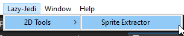
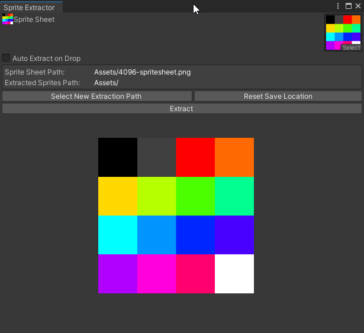
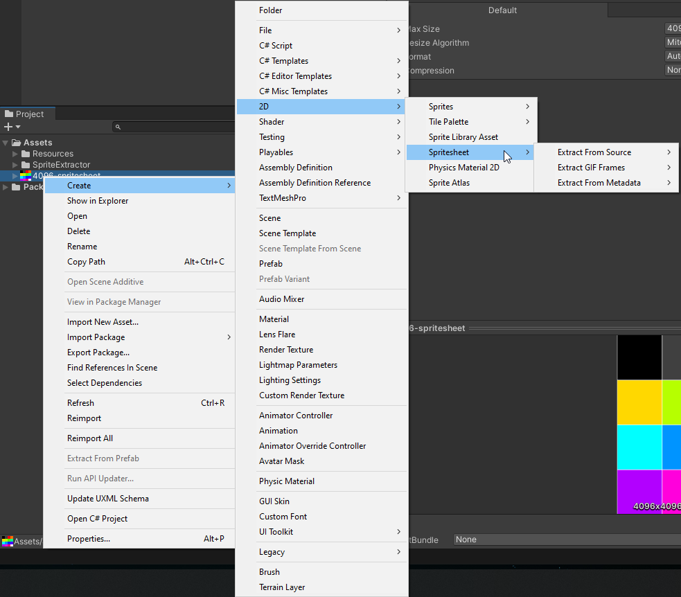

# Sprite Extractor Tool

The Sprite Extractor Tools allows you to extract sub sprites from a larger sprite sheet if you wish to do so. Save yourself painful manual labor by automatically cutting sprites using this tool.

## Tool Features

+ Drag and Drop Sprite Sheet Anywhere on the editor
+ Automatically Extract Sprites on Drop Toggle
+ Drag and Drop Multiple selected sprite sheets for Automatic Extraction (Auto Extract on Drop must be on)
+ Draggable and Zoomable Sprite Sheet Display Image
+ Quick Extraction Features (Sprite sheet and GIF):

## Additional Features:
+ Right Click and Extract Sprites
+ Choose where to Extract Sprites (current location of sprite sheet or any other folder)
+ Sprite sheet Setup

## Spritesheet Setup
Make sure you have the Unity Sprite Editor package installed that comes with the Unity 2D Packages.

### Sprite Mode
+ Multiple

### White Space Settings
+ To Allow White Space set Mesh Type to Full Rect.
+ To Remove White Space set Mesh Type to Tight.

### Read/Write Mode
+ Enable Read/Write mode

It's ok if you forget to do this step the sprite extractor will automatically apply this setting to your spritesheet if it has not been enabled.

After that you Slice your artwork Manually or Automatically using Unity's Sprite Editor (do not forget to apply your slicing changes).

## Extraction (Using the Tool)

Open the Sprite Extractor from the menu bar Lazy-Jedi/2D Tools/Sprite Extractor 

Then Select or Drag your Sprite Sheet onto the Tool and Click the Extract Button.

However, you can click the Auto Extract on Drop toggle to automatically extract your sprites.

## Extraction (Without using the Tool)

1. Find your Spritesheet
2. Right Click on your Spritesheet
3. Navigate to Create/2D/Spritesheet/ 
   1. Extract From Source
      1. Extracts all the Sliced Sprites
   2. Extract From Metadata
      1. Select and Extract one or more Images that was Sliced using the Unity Sprite Editor
4. Choose your extraction method
5. Done!

Sprite Extractor Tool now has an additional Tool for GIF Frame extraction.

To use the GIF extractor all you need to do is the following:

1. Find your GIF
2. Right Click on your GIF
3. Navigate to Create/2D/Spritesheet/Extract GIF Frames/
4. Choose your extraction method
5. Done!

Its that simple. It is that easy. Happy Extracting ♥