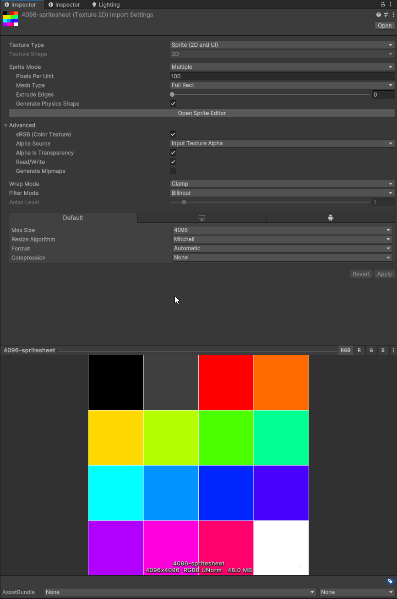
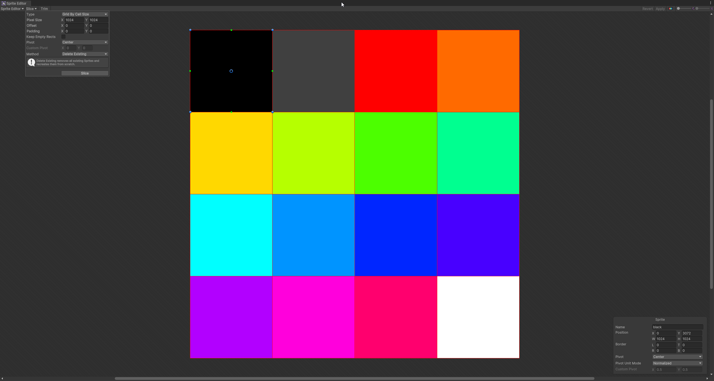
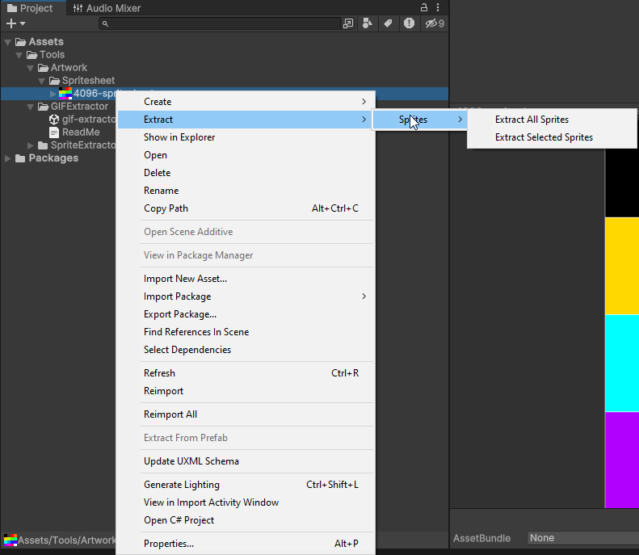
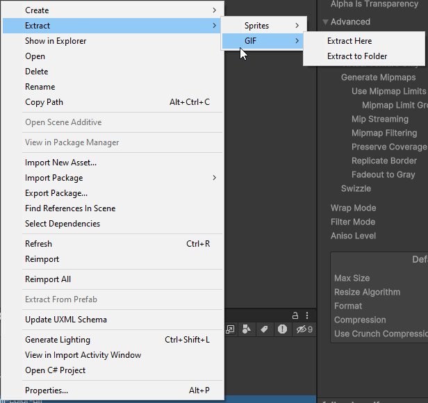

# Lazy Sprite Extractor

The Sprite Extractor Tool allows you to extract individual sprites from a larger sprite sheet. 

This version of the tool has been updated to use ISpriteEditorDataProvider to extract sprites from a spritesheet. 
I have included the old version of the tool in the repository, but it is no longer supported in newer versions of Unity.  

For those using older versions of Unity, you can find the old version of the tool as a package in the project.  

## Spritesheet Setup
Make sure you have the Unity Sprite Editor package installed that comes with the Unity 2D Packages.  
To setup your spritesheet correctly you need to apply some of the following changes.  
Changes that are denoted with an asterisk (*) are required!

### Sprite Mode *
+ Multiple

### White Space Settings
+ To Allow White Space set Mesh Type to Full Rect.
+ To Remove White Space set Mesh Type to Tight.

### Slicing

+ Click Sprite Editor
+ Slice your Spritesheet Manually by selecting regions you wish to extract
+ Slice your Spritesheet Automatically by either
  + Using the Automatic option - Unity automatically finds individual sprites in the spritesheet (may not work as desired)
  + Using the Cell Size of the individual Sprites
  + Using the Number of Columns and Rows the Spritesheet is made up of
+ Apply any padding and offsets that you may require
+ Click Apply once you are done!

Once this is done, you can use either the Sprite Extractor Tool or Quick Extraction to Extract the Sprites.

## Extraction

1. Find your Spritesheet
2. Right Click on your Spritesheet
3. Navigate to Assets/Extract/Sprites 
   1. Extract All Sprites
      1. Extracts all the Sliced Sprites
   2. Extract Selected Sprites
      1. Select and Extract one or more Sprites from the Source Spritesheet
4. Choose your extraction method
5. Done!

Sprite Extractor Tool now has an additional Tool for GIF Frame extraction.

## GIF Frame Extraction
To install the GIF Extractor Tool, you need to install the GIF Extractor Package that is included in the project.  

### Important
The GIF Extractor requires your Unity project to be set to .Net Framework.  
You can change this in the Player Settings under Other Settings -> Configuration -> Scripting Runtime Version.

### How to use

To use the GIF extractor all you need to do is the following:
1. Find your GIF
2. Right Click on your GIF
3. Navigate to Extract/GIF/
   1. Extract Here
      1. Extracts all the GIF Frames to the same folder as the GIF
   2. Extract to Folder
      1. Extracts all the GIF Frames to a folder of your choice
4. Done!
